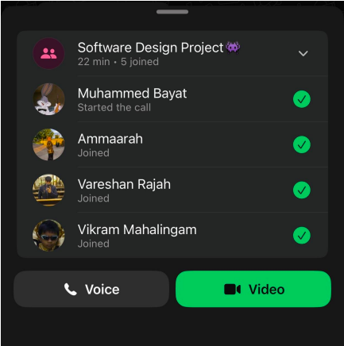

# Sprint 1 – Daily Scrum Meeting 1

## Date
30 March 2026

## Attendees
- Aaliah Reddy
- Muhammed Bayat
- Ammaarah Mia
- Vareshan Rajah
- Vikram Mahalingam

## Work Completed
- GitHub organization was set up
- A database solution was selected
- The Sprint 1 backlog was identified and agreed upon

## Work Planned
- Begin implementation of the frontend pages
- Begin backend setup for authentication and database integration

## Impediments
- None reported

## Notes
This meeting focused on planning Sprint 1, defining the sprint backlog, and allocating tasks to team members.

## Proof of Meeting

  

