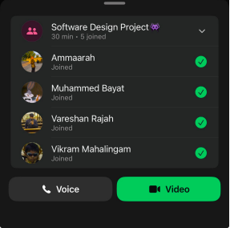

# Sprint 1 – Daily Scrum Meeting 2

## Date
07 April 2026

## Attendees
- Aaliah Reddy
- Muhammed Bayat
- Ammaarah Mia
- Vareshan Rajah
- Vikram Mahalingam

## Work Completed
- Frontend for the sign-up page was developed
- Frontend for the login page was developed
- Frontend for the landing page was developed
- Supabase authentication and database setup for login were completed
- Google login integration was completed
- Driver and test cases for sign-up were created

## User Stories Completed
- As a visitor, I can view the landing page so that I can understand the application and navigate to login or sign-up
- As a patient, I can access the sign-up page so that I can create a new account
- As a user, I can access the login page so that I can sign into my account
- As an admin, I can log in so that I can access the admin home page

## Work Planned
- Create the admin home page
- Create the patient home page
- Create the staff home page
- Complete sign-up implementation
- Implement Google sign-up
- Create login test cases
- Get GitHub Actions working

## Impediments
- GitHub Actions testing integration

## Proof of Meeting

  

