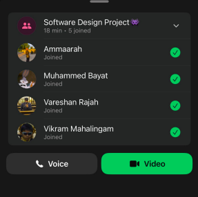

# Sprint 1 – Daily Scrum Meeting 3

## Date
10 April 2026

## Attendees
- Aaliah Reddy
- Muhammed Bayat
- Ammaarah Mia
- Vareshan Rajah
- Vikram Mahalingam

## Work Completed
- The admin home page was created
- Sign-up implementation was completed
- Google sign-up was implemented
- Login test cases were completed
- GitHub Actions was configured successfully

## User Stories Completed
- As a patient, I can sign up manually so that my account is created and stored in the system
- As a patient, I can register using Google so that my account is created and stored in the system

## Work Planned
- Create the patient home page
- Create the staff home page

## Impediments
- None reported

## Proof of Meeting

  

