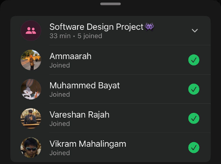

# Sprint 2 – Daily Scrum Meeting 1

## Date
14 April 2026

## Attendees
- Aaliah Reddy
- Muhammed Bayat
- Ammaarah Mia
- Vareshan Rajah
- Vikram Mahalingam

## What we spoke about
Aaliah suggested that for this sprint we should implement the functionality of finding the closest clinic as well as being able to search for clinics. Vareshan added that it may be a good idea to implement the admin home page as well and the front end of the staff home page. We spoke about what each page must have and possible things to consider such as linking the admin home page to supabase so that admins can add staff members and their associated clinics. The staff home page should have a way of seeing the appointments for the clinics. We also spoke about what was missing from our last sprint including implementing our code coverage tool on Github which needs to be done this sprint. We also noted that we need to create releases at the end of each sprint. Everyone has agreed that this should be the main focus for sprint 2. We also spoke about our plan for sprint 2, our user stories that we want to complete, the user acceptance tests for the user stories and decided on our task allocations.

## Proof of Meeting

  

