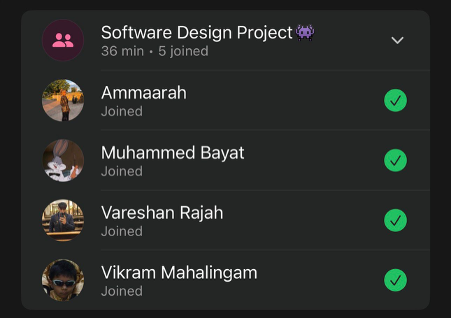

# Sprint 2 – Daily Scrum Meeting 2

## Date
15 April 2026

## Attendees
- Aaliah Reddy
- Muhammed Bayat
- Ammaarah Mia
- Vareshan Rajah
- Vikram Mahalingam

## What we spoke about
We spoke about what we all did today. I (Aaliah) asked everyone what has been done today.
Muhammed: Implemented the search functions so that users are able to search for a hospital
Vareshan: UI for the patient home page
Ammaarah: Putting the google logo and fixing password visibility and UI for staff dashboard
Vikram: Found the dataset and put it on supabase and did the map functionality
Aaliah: UI for admin dashboard.
Based on what we have done, we are thinking that if time allows, we can add more of our functionality. This will be discussed in the next meeting.

## What has been completed?
- Searching for clinics
- Patient home page front-end
- Staff home page front-end
- Admin home page front-end
- Map functionality

## User stories completed
- As a patient, I can search for a clinic by name and then get a list of clinics
- As a user, I can log out of my profile so that I can return to the landing page
- As a patient, I can search a province to get a list of clinics in that province
- As a patient, I can search a clinic by facility type to get a list of clinics of that type

## Challenges experienced
None noted.

## What still needs to be done?
- Admin functionality

## Proof of Meeting

  

