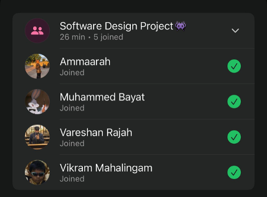

# Sprint 2 – Daily Scrum Meeting 3

## Date
16 April 2026

## Attendees
- Aaliah Reddy
- Muhammed Bayat
- Ammaarah Mia
- Vareshan Rajah
- Vikram Mahalingam

## What we spoke about
We spoke about what we all have done so far. 
Aaliah: I have been trying to do the create Admin function but I keep getting an error and I am very frustrated.
Vikram: Been trying to do the forgot password but the redirect is not working
Muhammed: Added code coverage to github and fixed deployment issues
Vareshan: Created front-end for the entire-patient dashboard
Ammaarah: Finalised staff-dashboard

## What has been completed?
- Code coverage added to github
- Front-end for patient dashboard
- Front-end for staff dashboard

## User stories completed
N/A

## Challenges experienced
Add admin functionality

## What still needs to be done?
- Admin functionality

## Proof of Meeting

  

