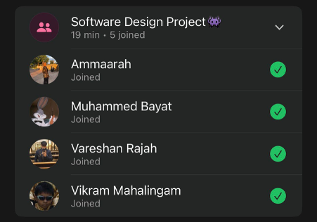

# Sprint 2 – Daily Scrum Meeting 4

## Date
18 April 2026

## Attendees
- Aaliah Reddy
- Muhammed Bayat
- Ammaarah Mia
- Vareshan Rajah
- Vikram Mahalingam

## What we spoke about
Aaliah and Vikram have been trying to debug the add admin function, it has been quite a challenge and it is still not working. Aaliah mentioned her changes in her branch so they don’t affect anything when they merge on to main. Muhammed and Ammarah said what they’ve both done and Ammarah is having issues with searching for clinics in the admin home page. Vareshan said he is going to implement add staff members today. We still need to complete the UML diagrams.

## What has been completed?
- Make a booking
- Reschedule a booking
- Cancel a booking
- Admins can view staff members and search for them
- Admins can view clinics and search for them
- View staff count, clinic count and the number of appointments today from the admin dashboard

## User stories completed
- As an admin, I can view and search for staff so that I can view their information
- As a patient, I can make a booking so that I can secure an appointment at a clinic at a convenient time
- As a patient, I can cancel a booking so that I can free up my slot if I no longer need the appointment
- As a patient, I can reschedule a booking so that I can change my appointment to a more suitable date or time
- As an admin, I can view the total number of staff so that I can monitor workforce size
- As an admin, I can view the total number of clinics so that I can understand the systems coverage and manage clinic distribution
- As an admin, I can view the number of appointments scheduled for today so that I can assess daily workload and operational demand.

## Challenges experienced
Add admin functionality

## What still needs to be done?
- Debugging the add admin feature
- Add staff member feature

## Proof of Meeting

  

