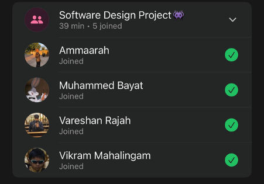

# Sprint 2 – Retrospective meeting

## Date
19 April 2026

## Attendees
- Aaliah Reddy
- Muhammed Bayat
- Ammaarah Mia
- Vareshan Rajah
- Vikram Mahalingam

## What we spoke about
We spoke about how we all felt about this sprint. 

Aaliah: It was a good sprint. Our teamwork was very good especially when it came to challenges such as the add admin and add staff functionality. We worked together to get that done. I completed the admin-dashboard, the statistics functions and had help from Vareshan in completing the add admin functionality. We achieved more than we thought we could which shows how well we work together.

Muhammed: This was a good sprint. We had a lot of good stuff done. We managed to do the patient functionality done where patients can search for clinics, make a booking, reschedule a booking and cancel a booking.

Ammaarah: I thought it was good. I did the staff dashboard, the staff and clinic search for the admin page.  I think we worked well together as usual. I enjoy working with my group. I am excited for the next sprint.

Vikram: I had a good sprint. I attempted to offer my help with the add admin however, I struggled to find the issue. I managed to obtain the dataset (from Aaliah), I added the map functionality which was surprisingly easy. I have also gotten more used to the testing. Overall, I thought this was a good sprint and we managed to get a lot done.

Vareshan: I won’t lie this sprint was a bit of a head scratcher for me. I started doing the patient-dashboard front-end and then it came to the add staff which was very difficult. Eventually I managed to implement add staff and help Aaliah complete the add admin , despite all the challenges we faced. We managed to do everything we needed to do and now I am feeling very good about this sprint and am ready to tackle what comes next. I am so proud of my team for all that they have accomplished.

## What has been completed?
- Add admin
- Add staff
- Admin view clinics

## User stories completed
N/A

## Challenges experienced
- As an admin I can add a staff member to assign them to a clinic
- As an admin I can add an admin to give them admin permission
- As an admin, I can view and search for clinics so that I can view their information

## Proof of Meeting

  

