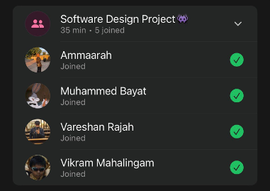

# Sprint 3 – Daily Scrum Meeting 1

## Date
25 April 2026

## Attendees
- Aaliah Reddy
- Muhammed Bayat
- Ammaarah Mia
- Vareshan Rajah
- Vikram Mahalingam

## What we spoke about
We spoke about our plan for this sprint. Since this is a longer sprint we think that we can get more done. So our plan is to finish the patient and admin pages and start on the staff page. Some of the admin page requires information from the staff page so the entire admin page will not be completed as yet in terms of the analytics. We also spoke about the issues our client wanted us to fix. Such as removing the “no results found” before a search, protecting our main branch on Github and figuring out how to automatically refresh analytics without refreshing the page each time. We also spoke about updating our UML diagrams as we add more functionality. We want to implement that admins can edit clinics. Some more small fixes include autofill searches, fix the clinics to be a scroll bar and staff button to show all staff and their clinics and search staff and add the remove button.

## Proof of Meeting

  

