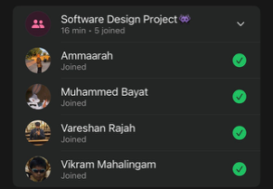

# Sprint 3 – Daily Scrum Meeting 2

## Date
30 April 2026

## Attendees
- Aaliah Reddy
- Muhammed Bayat
- Ammaarah Mia
- Vareshan Rajah
- Vikram Mahalingam

## What we spoke about
We spoke about what we have all done. Aaliah did most of the admin functionality including the edit clinic function and the bar that has the recent activity. Muhammed did most of the patient stuff including the patient queueing system. Ammaarah fixed the admin staff and clinic search functions but hasn’t gotten to the remove staff function yet. All the fixes that the client wanted us to fix including removing “no clinics found” when the search bar is empty, the back buttons, auto scroll, autofill clinic names. We also spoke about what still needs to be done, Vikram said he will start on the staff page and Vareshan said he will start on the edit profiles and any small fixes that need to be made.

## What has been completed?
- Patient queue functionality
- Admins can edit clinics
- Admins can view recent activity

## User stories completed
- As a patient, I can select a clinic to view the current queue so that I can see how busy the clinic is before deciding to join
- As a patient, I can join a clinic queue so that I can reserve my place before arriving or while waiting
- As a patient I can leave a queue so that I can cancel my place if I no longer want to wait
- As an admin, I can edit a clinics operating hours so that patients know when the clinic and queue services are available
- As an admin, I can view the recent activity of admin changes so that I can keep track of important system updates

## Challenges experienced
None noted.

## What still needs to be done?
- The whole staff page functionality 
- Edit profiles
- The remove staff function
- Add a few tweaks to the queueing system
- Times according the database

## Proof of Meeting

  

