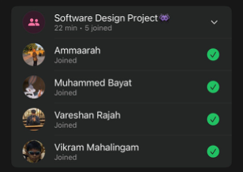

# Sprint 3 – Daily Scrum Meeting 3

## Date
05 May 2026

## Attendees
- Aaliah Reddy
- Muhammed Bayat
- Ammaarah Mia
- Vareshan Rajah
- Vikram Mahalingam

## What we spoke about
We spoke about what we have all done so far. Vikram has completed the back end for staff page. Aaliah has finished most of the admin page by completing the recent activity but she still has a small bug to fix. Aaliah also fixed some bugs on the admin page and finished the patients waiting tile. We also spoke about what still needs to be done, UI for the staff page, and remove staff function. 

## What has been completed?
- Staff functionality

## User stories completed
- As a staff member, I can manage the queue so that I can update patient queue progress and keep the clinic flow organised
- As a staff member, I can create an appointment on a patients behalf so that patients who cannot book themselves can still receive appointment slots
- As a staff member, I can cancel an appointment on a patients behalf so that the appointment schedule remains accurate when a patient can no longer attend
- As a staff member, I can reschedule an appointment on a patients behalf so that patients can be moved to a more suitable date or time without losing their booking

## Challenges experienced
None noted.

## What still needs to be done?
- UI for the staff page to be finished
- Remove staff function on the admin page

## Proof of Meeting

  

