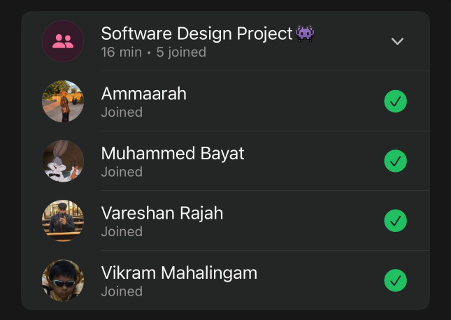

# Sprint 3 – Daily Scrum Meeting 4

## Date
06 May 2026

## Attendees
- Aaliah Reddy
- Muhammed Bayat
- Ammaarah Mia
- Vareshan Rajah
- Vikram Mahalingam

## What we spoke about
We had to have an urgent meeting because Vareshan was meant to do the staff UI but there is some functionality on the staff page that hasn’t been implemented yet and we needed to check if those buttons needed to be there. We eventually concluded that we don’t need those buttons because the staff page itself shows everything that is necessary so those simply just need to be removed and then just added the “profile” button for when we implement the edit profile functionality in the next sprint.

## What has been completed?
N/A

## User stories completed
N/A

## Challenges experienced
None noted.

## What still needs to be done?
- UI for the staff page to be finished
- Remove staff function on the admin page

## Proof of Meeting

  

