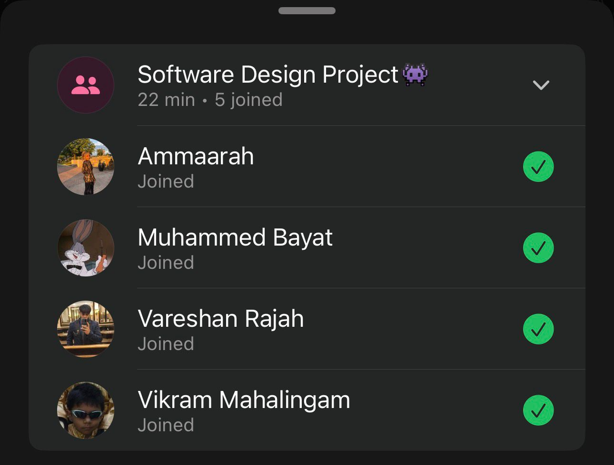

# Sprint 3 – Retrospective meeting

## Date
10 May 2026

## Attendees
- Aaliah Reddy
- Muhammed Bayat
- Ammaarah Mia
- Vareshan Rajah
- Vikram Mahalingam

## What we spoke about
We spoke about how we all felt about this sprint. 

Aaliah: I think this was a good sprint. I finished most of the admin page functionality including the edit clinic functionality where an admin can change the clinic operating hours. I also implemented the recent activity tile where an admin can view their recent changes. I also fixed small bugs on the admin page.

Muhammed: This sprint, I worked on implementing the *patient queue functionality*. I reused the existing clinic search function from the booking page, allowing users to search for and select a clinic. After selecting a clinic, users can view the clinic’s current queue, including an estimated wait time. From there, they can join the queue or leave the queue when needed. I also added queue visibility to the dashboard, so users can see their current queue status directly from there.

In addition, I worked on the *View Appointments* page, where users can see all the appointments they have made. Appointments can now be ordered by status and date, making it easier to separate past and future appointments.

Overall, this work improved the patient experience by making clinic queues easier to access, manage, and track, while also improving appointment visibility and organisation.

Ammaarah: This sprint I added the scrollbar to the staff and clinic list popups by applying max-height and overflow-y: auto to the .activity-list CSS class, and styled each staff list item with a .staff-list-item class to display the email and a remove button side by side. I completed the remove staff functionality by implementing a removeStaff function that deletes a staff member from the profiles table in Supabase using their email. I also added a staffToRemove state variable and a confirmation dialog that appears before deletion, preventing accidental removals.Also during this sprint I updated the Process View UML diagrams to reflect the new Sprint 3 features.This sprint my contributions were smaller in scope than Sprint 2 but more focused on getting existing features working correctly end to end. The remove staff feature is a complete user-facing flow — from clicking remove, through a confirmation dialog, to a live database deletion and UI update. I also became more comfortable resolving merge conflicts independently.

Vikram: This sprint was good. I used my time effectively. I did a lot last sprint so just finished up other major functionality. I only need to finish up minor fixes.

Vareshan: This sprint went really well, we all communicated really well together even though the sprint was really long, I worked with Vik which went really well on the Staff Page, he did the backend whilst I implemented it with the UI.

## What has been completed?
- Admins can remove staff members

## User stories completed
- As an admin, I can remove a staff member so that I can revoke their access when they no longer work at a clinic or should no longer have staff permissions.

## Challenges experienced
None noted

## Proof of Meeting

  

