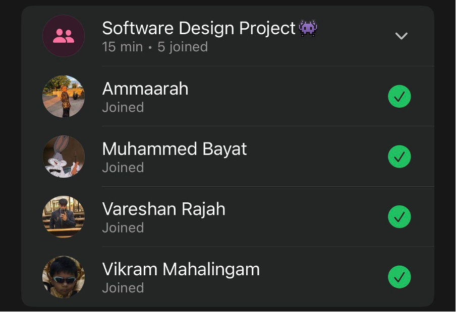

# Sprint 4 – Daily Scrum Meeting 1

## Date
11 May 2026

## Attendees
- Aaliah Reddy
- Muhammed Bayat
- Ammaarah Mia
- Vareshan Rajah
- Vikram Mahalingam

## What we spoke about
We spoke about our plan for this sprint. Since most of our functionality is done we only have a few things to implement such as the forgot password functionality, users can change their user names and passwords as well as the analytics that need to be completed and exported via CSV. We also need to fix a few UI elements, and other small bug fixes.

## Proof of Meeting

  

