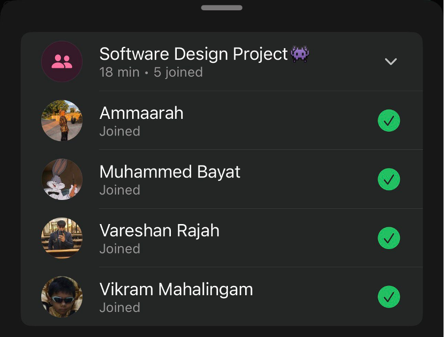

# Sprint 4 – Daily Scrum Meeting 2

## Date
12 May 2026

## Attendees
- Aaliah Reddy
- Muhammed Bayat
- Ammaarah Mia
- Vareshan Rajah
- Vikram Mahalingam

## What we spoke about
We spoke about what we all did. So far only Aaliah has done a few things. She completed the fixes for the staff UI and did the edit user name for every page (staff, patient and admin) so that a user can edit their user name and it’ll reflect their names on the page otherwise it’ll show their google user names (if logged in with google) or if not it’ll show the first part of their email address before the “@”. 

## What has been completed?
- Users can change their usernames

## User stories completed
- As a user, I can change my username so that I can keep my account information accurate and up to date.

## Challenges experienced
None noted.

## What still needs to be done?
- The admin analytics
- The forgot password
- Users can change their password
- Fixing the remove staff function
- Reflecting the changed times on the patient page
- Reflecting changed times on the staff page

## Proof of Meeting

  

