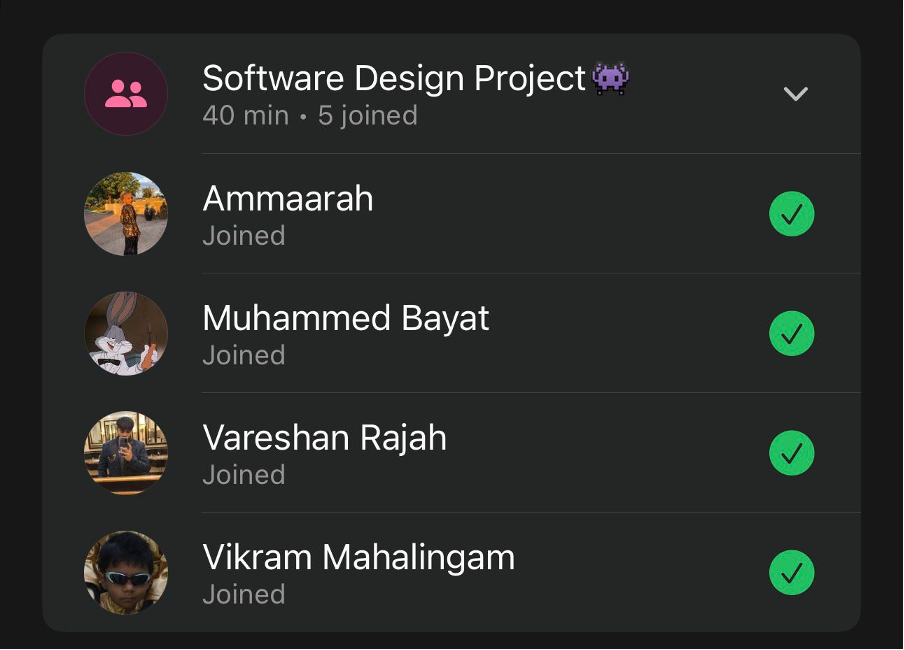

# Sprint 4 – Daily Scrum Meeting 3

## Date
14 May 2026

## Attendees
- Aaliah Reddy
- Muhammed Bayat
- Ammaarah Mia
- Vareshan Rajah
- Vikram Mahalingam

## What we spoke about
Aaliah said that she finished the admin analytics so it shows the average patient wait times per clinic and time of day and the appointment no show rates. Aaliah also added that staff members can check patients in to their appointment. We had a bit of an issue with our deployed site so we are trying to figure out what went wrong. Everyone still has quite a bit to do. The forgot password, change password, remove staff and all the other fixes still need to be done. We think the issue could have been from a new branch. Muhammed is trying to fix it.

## What has been completed?
- Clinic analytics
- Staff can check patients in to their appointments

## User stories completed
- As an admin, I can export clinic analytics as a CSV or PDF file so that I can analyse data externally, generate reports, and keep records.
- As a staff member, I can check a patient in to their appointment so that the clinic can record that the patient has arrived and is not a no show.

## Challenges experienced
None noted.

## What still needs to be done?
- The forgot password
- Users can change their password
- Fixing the remove staff function
- Reflecting the changed times on the patient page
- Reflecting changed times on the staff page

## Proof of Meeting

  

