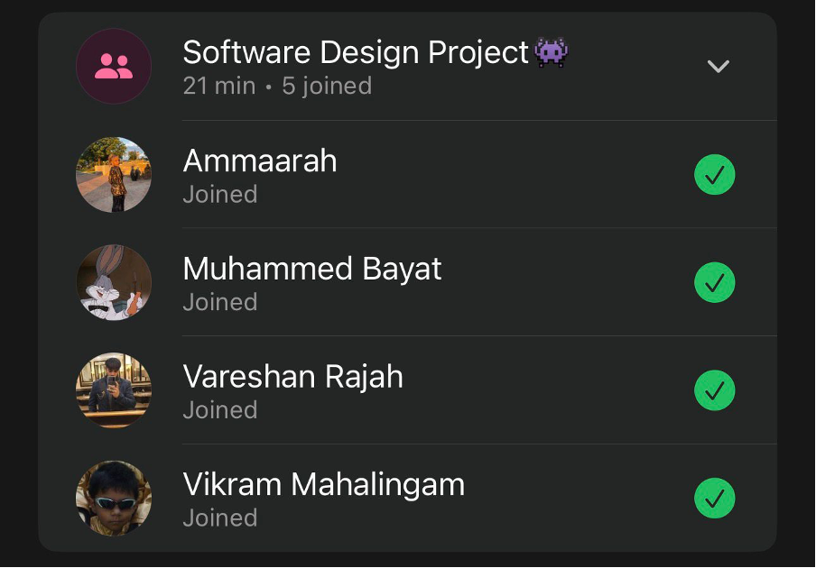

# Sprint 4 – Daily Scrum Meeting 4

## Date
16 May 2026

## Attendees
- Aaliah Reddy
- Muhammed Bayat
- Ammaarah Mia
- Vareshan Rajah
- Vikram Mahalingam

## What we spoke about
We spoke about what we all did. Ammaarah finished fixing her remove staff function. Vareshan implemented the change password functionality across all pages. Muhammed is still busy fixing the patient and staff pages to align with clinic operating hours, Aaliah just had to clarify what he must do. Vikram finished the forgot password functionality. We also spoke about the documentation and what needed to be put on to Github because all of our documentation needs to be on Github for when he hand in and all the links to the documents need to work. Aaliah told everyone to upload their retrospectives and asked a few questions about the README which Vareshan will do. We still need to make the video to hand in as well and finish linking everything to our hand-in document.

## What has been completed?
- Forgot password functionality
- Change password functionality

## User stories completed
•As a user, I can reset my password when I forget it so that I can regain access to my account securely.
•As a user, I can change my password so that I can maintain the security of my account.

## Challenges experienced
None noted.

## What still needs to be done?
- Patient and Staff patients to reflect clinic operating hours

## Proof of Meeting

  

