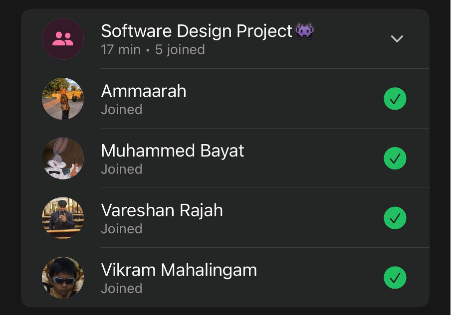

# Sprint 4 – Retrospective meeting

## Date
17 May 2026

## Attendees
- Aaliah Reddy
- Muhammed Bayat
- Ammaarah Mia
- Vareshan Rajah
- Vikram Mahalingam

## What we spoke about
Muhammed managed to finish the patient and staff page reflecting the clinic operating hours.

We spoke about how our last sprint went.

Aaliah: This sprint went by really quick and was a little bit stressful because it was our last sprint, however, we managed to finish our app and get most of the documentation done to hand it in. I am going to miss working with everyone but I am also glad that we are finally done and are ready to present our final app.

Vareshan: This sprint went quite quickly compared to last, however I did manage to complete what I was supposed to and thanks to Aaliah she made it a lot easier for me to implement the change of password functionality since she already created the pop dialogue for me to work on. Overall I think the sprint went quite well.

Muhammed: It was a short sprint, mainly focused on setting clinic times so that when an admin sets the clinic time, it reflects over all patient and staff functionality, including the reschedule functionality. Enhanced the staff functionality so that it can view upcoming appointments, view the current days appointments, cancelled appointments and view passed appointments

Ammaarah: During this sprint I fixed a bug in the removeStaff function where deleting a staff member was failing with a foreign key constraint error because the clinicStaff table still referenced the profile being deleted. I resolved this by first fetching the staff member's profile id, deleting their record from the clinicStaff table, and then deleting from the profiles table in the correct order. I also updated the Process View UML diagrams, both the activity diagram and sequence diagram.

Vikram: Sprint was good we finished everything up an fixes all the minor issues we had, the site going down was unexpected but Mo got it up in a day or two

## What has been completed?
- N/A

## User stories completed
- N/A

## Challenges experienced
None noted

## Proof of Meeting

  

