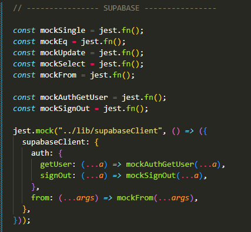
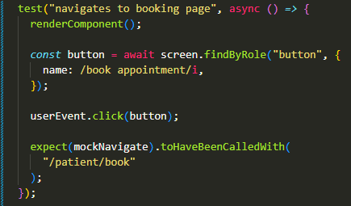
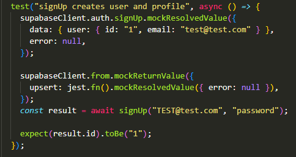
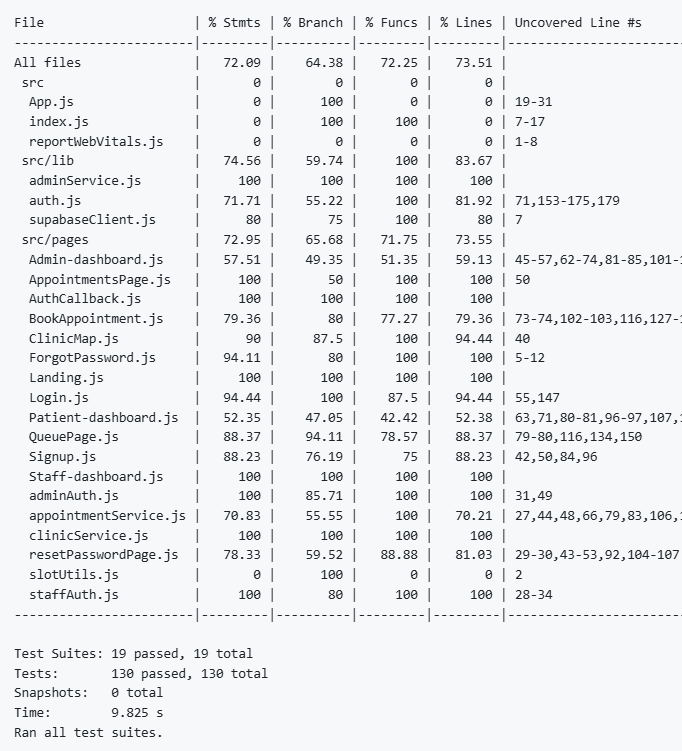
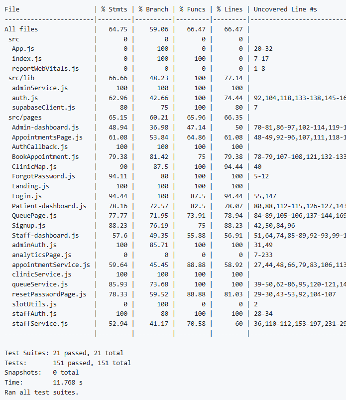

# Test Plan and Results

## Testing Strategy

A Sandwich Testing approach was taking in regards to Integration Testing. The reason for this is that the use of external services like Supabase and Google OAuth required the use of Stub to mock the results from these systems, additionally since components and functions were created asynchronously drivers were used to simulate high-level executions for consistent testing practices across all test files

## Test Cases

### Example of a Supabase Mock

  

### Example of Test Case for UI functionality

  

### Example of Test Case for backend functionality

  

## Results of Testing

Test Coverage stayed consistently above the threshold for each Sprint (Sprint 1 did not have a coverage requirement)

### Sprint 2 Coverage

  

### Sprint 3 Coverage

  

### Sprint 4 Coverage